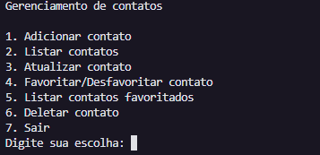
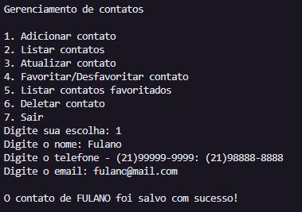
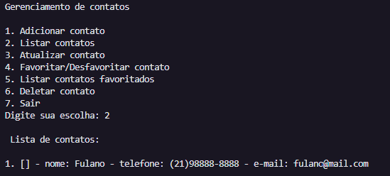
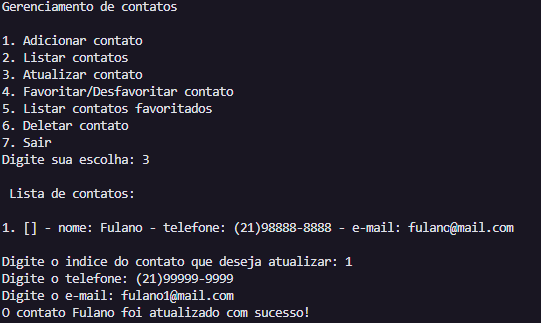
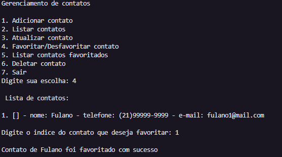
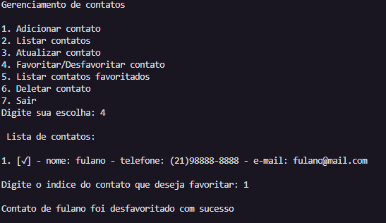
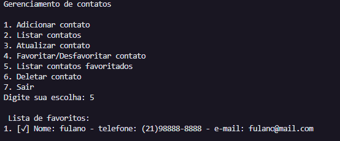
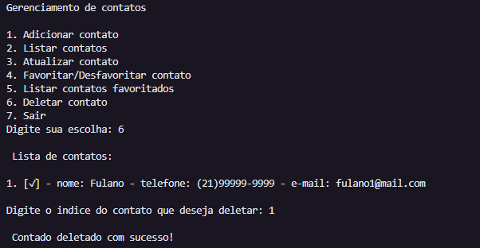

# Agenda de contatos

### Projeto que tem por objetivo criar uma agenda de contatos utilizando conceitos com funções e utilização de while.

#### Regras da aplicação:
- No terminal deve aparecer a lista opções que o usuário tem, que são elas:
  1. Adicionar contato;
  2. Listar contatos;
  3. Atualizar contato;
  4. Favoritar/Desfavoritar contato;
  5. Listar contatos favoritados;
  6. Deletar contato;
  7. Sair

- Para adicionar um contato e precisor ter:
  - Nome
  - Telefone
  - E-mail

 exemplo: contato = { nome:"contato", telefone: "telefone", email:"email", favorito: False }
o campo favorito vem por padrão com o valor de False onde é feita a alteração na opçãp 4. Favoritar/Desfavoritar contato

### Funcionamento:

### Adicionar contato:

### Listar contatos:

### Atualizar contato:

### Favoritar/Desfavoritar contato:

#### Favoritar:

#### Desfavoritar:

### Listar contatos favoritados:

### Deletar contato:

